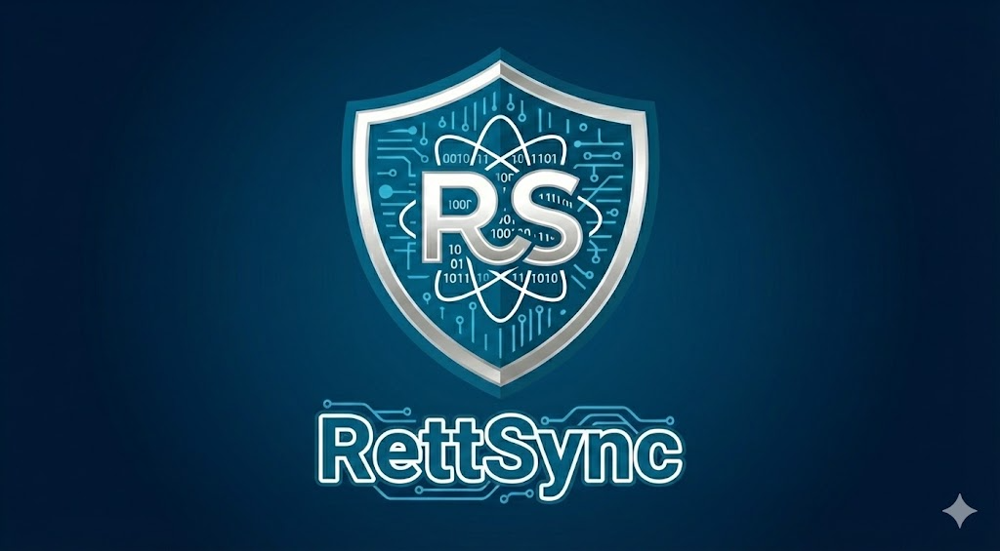

  
  <h1>RettSync</h1>
  
<strong>Digital solutions you own. No subscriptions.</strong>

  

    <a href="https://rettsync.com"><b>Website</b></a> •
    <a href="mailto:tech@rettsync.com"><b>Contact</b></a> •
    <a href="https://rettsync.com/#industries"><b>Industry Solutions</b></a>
  

---

### 🇩🇰 About RettSync

RettSync is a Danish software consultancy that designs and implements custom business software.  
Instead of locking clients into subscription-based SaaS, we build **proprietary digital ecosystems** that are legally and technically owned by the client from day one.

Our goal is to combine the reliability of enterprise systems with the speed and usability of modern web and mobile apps.

| Core Value | Description |
| :--- | :--- |
| **Zero Subscriptions** | One-time license with transparent project pricing. No recurring SaaS fees. |
| **100% IP Ownership** | You receive full source code (Flutter / TypeScript) and related assets. |
| **Your Cloud** | Solutions are deployed to **your** private Google Cloud / Firebase account. |

---

### 🛠 Technology Focus

We build full-stack web and mobile applications on top of the **Google Cloud Firebase** ecosystem, with a strong focus on robustness, maintainability, and long-term ownership.

#### Frontend & Mobile
- **Flutter** for iOS, Android, and Web from a single shared codebase
- **Offline-first** capabilities for work in the field and low-connectivity environments
- Modern, task-focused UX for operational teams

#### Backend & Infrastructure (Serverless)
- **Cloud Functions** for business logic and automation
- **Cloud Firestore** for real-time, scalable data
- **Firebase Hosting** for fast, global content delivery
- **Firebase Auth** for secure identity and access management
- **Cloud Storage** for compliant file and document handling

---

### 🚀 Industry-Focused Architectures

RettSync delivers pre-architected, customizable solutions for operationally intensive sectors:

#### Service & Trades
- **Construction & Trades** – Time tracking, material usage, project cost overview  
- **Cleaning & Facilities** – Digital logbooks, quality reporting, checklists  
- **Landscaping** – Route planning, seasonal task management  
- **Mobile Mechanics** – VIN scanning, field invoicing, job documentation  
- **Facility Management** – Tenant tickets, maintenance workflows, SLAs

#### Retail & Logistics
- **Food & Hospitality** – HACCP documentation, reservations, table and shift management  
- **Retail** – iPad POS, inventory sync, loyalty and promotions  
- **Warehousing (Lager)** – Barcode scanning, pick–pack–ship workflows, stock accuracy

#### Specialized
- **Pest Control** – Legal documentation and mandatory reporting of poison usage

---

### 💡 Custom & Startup Projects

For unique ideas and new products, RettSync offers a **Sovereign MVP Track**:

- **Rapid delivery** – From idea to first production-ready version in weeks  
- **Built for scale** – Architecture prepared for growth, integrations, and compliance  
- **Investor-friendly** – Full IP ownership and transparent technology stack

If you are a founder or established company looking to fully own your critical software, this track is typically the best entry point.

---

### 🤝 How to Work With RettSync

- **Discovery & Architecture** – Clarify business goals, workflows, and technical requirements  
- **Implementation** – End-to-end development of web and mobile applications  
- **Handover & Ownership** – Source code, infrastructure, and documentation are transferred to you  
- **Optional Support** – Ongoing advisory and feature development on your terms (no lock-in)

For inquiries, integrations, or collaboration opportunities:

- 📧 **Email:** [tech@rettsync.com](mailto:tech@rettsync.com)  
- 🌐 **Website:** [rettsync.com](https://www.rettsync.com)

 

  
  
  
    
  <b>RettSync</b> • Brøndby, Denmark • CVR: 46142306

